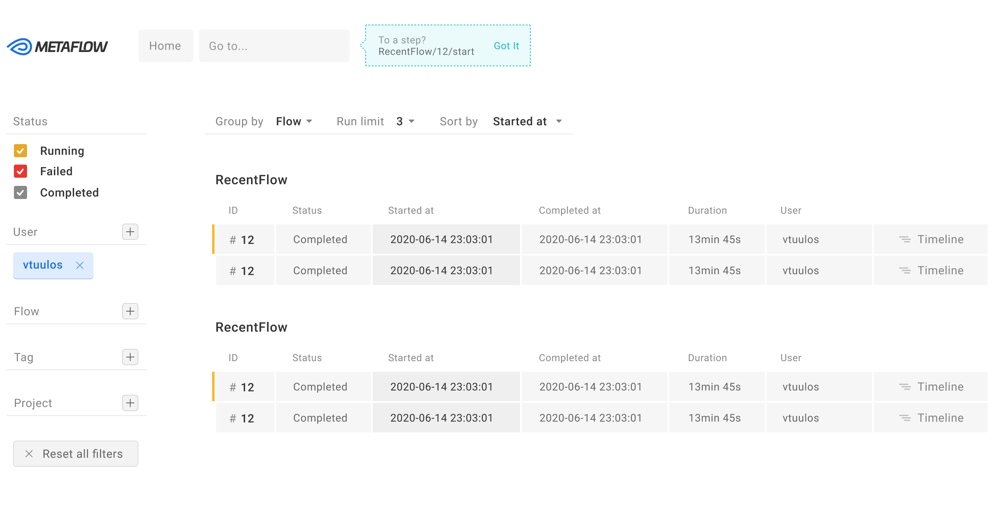

# Metaflow UI

[](https://github.com/Netflix/metaflow-ui/releases/latest)



## Getting started

Run the app in the development mode. Open [http://localhost:3000](http://localhost:3000) to view it in the browser.

```bash
$ yarn start
```

Modify Metaflow UI Service proxy and endpoints:

```bash
# Modify development proxy destination (default: http://localhost:8083)
$ METAFLOW_SERVICE_PROXY=http://localhost:8083 yarn start

# Modify both API & Websocket endpoint (default: /api via proxy)
# NOTE: Use this in case proxy is causing problems
$ REACT_APP_METAFLOW_SERVICE=http://localhost:8083 yarn start

# Modify Websocket endpoint (default: same as API with /ws suffix)
$ REACT_APP_METAFLOW_SERVICE_WS=http://localhost:8083/ws yarn start
```

Launch the test runner in the interactive watch mode.

```bash
$ yarn test
```

Build the app for production to the `build` folder.

```bash
$ yarn build
```

It correctly bundles React in production mode and optimizes the build for the best performance.

## Documentation

- [**Metaflow documentation**](https://docs.metaflow.org)
- [**React documentation**](https://reactjs.org)
- [**Create React App documentation**](https://facebook.github.io/create-react-app/docs/getting-started)

## Contributing

Learn how to start contribution on the [Contributing Guideline](CONTRIBUTING.md)

## Get in Touch

There are several ways to get in touch with us:

- Open an issue at: https://github.com/Netflix/metaflow-ui
- Email us at: help@metaflow.org
- Chat with us on: http://chat.metaflow.org
