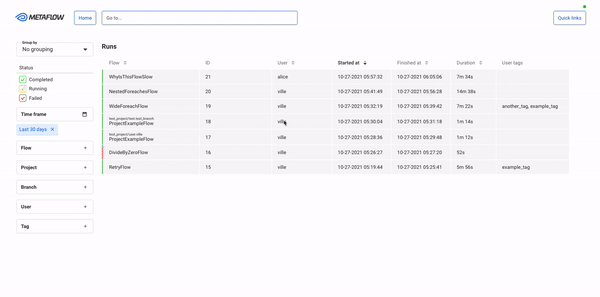

<p align="center">
  
</p>


# Metaflow UI

[](https://github.com/Netflix/metaflow-ui/actions) [](https://github.com/Netflix/metaflow-ui/releases/latest)

Metaflow UI is a tool to monitor [Metaflow](https://github.com/Netflix/metaflow) workflows in real-time.

## Getting started

Using Metaflow UI requires [Metaflow Service](https://github.com/Netflix/metaflow-service) for now.

To setup a local development environment, see [docs/README.md](docs/README.md).

### Deploying the UI

Deploying Metaflow UI requires setting up a UI service (which is different from the Metaflow service but uses the same backing database). To deploy the UI service, follow instructions at [Metaflow UI Service](https://github.com/Netflix/metaflow-service).

### Docker support

Dockerfile provides support for an `nginx` container hosting the production build of the application.

```sh
# Build Docker image
$ docker build --tag metaflow-ui:latest .
# Run Docker container on port 3000
$ docker run -p 3000:3000 metaflow-ui:latest
# Run Docker container using custom API endpoint
$ docker run -p 3000:3000 -e METAFLOW_SERVICE=http://custom-ui-backend/api metaflow-ui:latest
```

For example, when used with a locally deployed [Metaflow UI Service](https://github.com/Netflix/metaflow-service), the UI can be launched with

```sh
docker run -p 3000:3000 -e METAFLOW_SERVICE=http://localhost:8083/ metaflow-ui:latest
```

Dockerfile also supports the following environment variables to inject content into the UI's index.html:

- `METAFLOW_HEAD` - Inject content to `head` element
- `METAFLOW_BODY_BEFORE` - Inject content at the beginning of `body` element
- `METAFLOW_BODY_AFTER` - Inject content at the end of `body` element

Use cases for these variables range from additional meta tags to analytics script injection.

Example on how to add a keyword meta tag to Metaflow UI:

```
METAFLOW_HEAD='<meta name="keywords" content="metaflow" />'
```

### Plugins development

See [docs/plugin-system.md](docs/plugin-system.md) to get started with plugins development.

## Documentation

See [docs/README.md](docs/README.md) to learn more.

General Metaflow documentation available [here](https://docs.metaflow.org):

## Contributing

We welcome contributions to Metaflow. Please see our [contribution guide](CONTRIBUTING.md) for more details.

## Get in Touch

There are several ways to get in touch with us:

- Open an issue at: https://github.com/Netflix/metaflow-ui
- Email us at: help@metaflow.org
- Chat with us on: http://chat.metaflow.org
