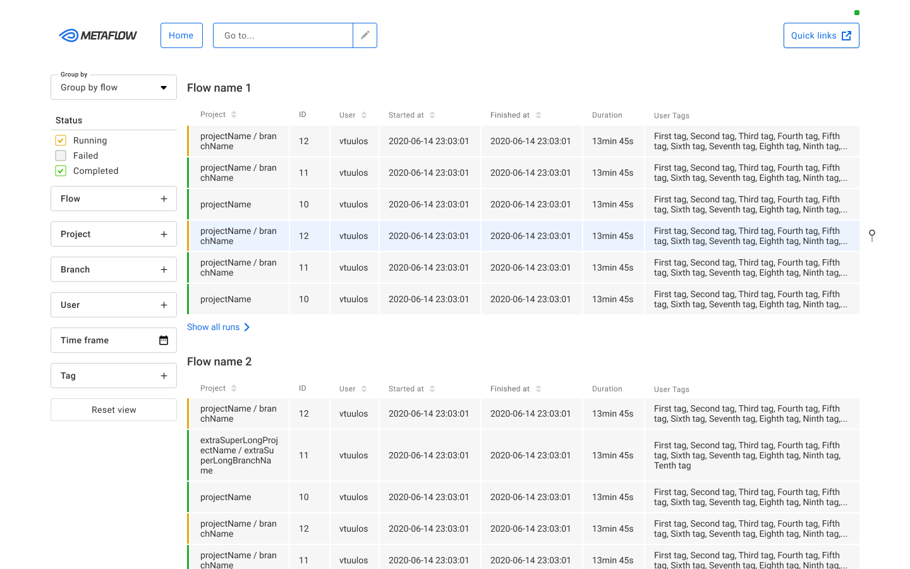

# Metaflow UI

[](https://github.com/Netflix/metaflow-ui/actions) [](https://github.com/Netflix/metaflow-ui/releases/latest)

Metaflow UI is tool to monitor [Metaflow](https://github.com/Netflix/metaflow) workflows in real-time.

## Getting started

Using Metaflow UI requires [Metaflow Metadata Service](https://github.com/Netflix/metaflow-service) for now.

See [docs/README.md](docs/README.md) to setup local development environment.

### Plugin development

See [docs/plugin-system.md](docs/plugin-system.md) to get started with plugin development.

### Installation to server

Metaflow UI has separate backend service from Metaflow Metadata Service but it is using same Database. To setup UI service to your server follow instructions at [Metaflow UI Service](https://github.com/Netflix/metaflow-service/tree/ui).

### Docker support

Dockerfile provides support for nginx container hosting the production build of the application.

```sh
# Build Docker image
$ docker build --tag metaflow-ui:latest .
# Run Docker container on port 3000
$ docker run -p 3000:3000 metaflow-ui:latest
# Run Docker container using custom API endpoint
$ docker run -p 3000:3000 -e METAFLOW_SERVICE=http://custom-ui-backend/api metaflow-ui:latest
```

For example when used with locally setup [Metaflow Metadata UI Service](https://github.com/Netflix/metaflow-service/tree/ui) UI could be ran with

```sh
$ docker run -p 3000:3000 -e METAFLOW_SERVICE=http://localhost:8083/ metaflow-ui:latest
```

Dockerfile also supports following environment variables to inject content to Metaflow UI index.html:

- `METAFLOW_HEAD` - Inject content to `head` element
- `METAFLOW_BODY_BEFORE` - Inject content at the beginning of `body` element
- `METAFLOW_BODY_AFTER` - Inject content at the end of `body` element

Use case for these variables ranges from additional meta tags to analytics script injection.

Example on how to add keyword meta tag to Metaflow UI:

```
METAFLOW_HEAD='<meta name="keywords" content="metaflow" />'
```

## Documentation

See [docs/README.md](docs/README.md) to learn more.

General Metaflow documentation available here:

- [**Metaflow documentation**](https://docs.metaflow.org)
- [**React documentation**](https://reactjs.org)
- [**Create React App documentation**](https://facebook.github.io/create-react-app/docs/getting-started)

## Contributing

Learn how to start contribution on the [Contributing Guideline](CONTRIBUTING.md)

## Get in Touch

There are several ways to get in touch with us:

- Open an issue at: https://github.com/Netflix/metaflow-ui
- Email us at: help@metaflow.org
- Chat with us on: http://chat.metaflow.org
