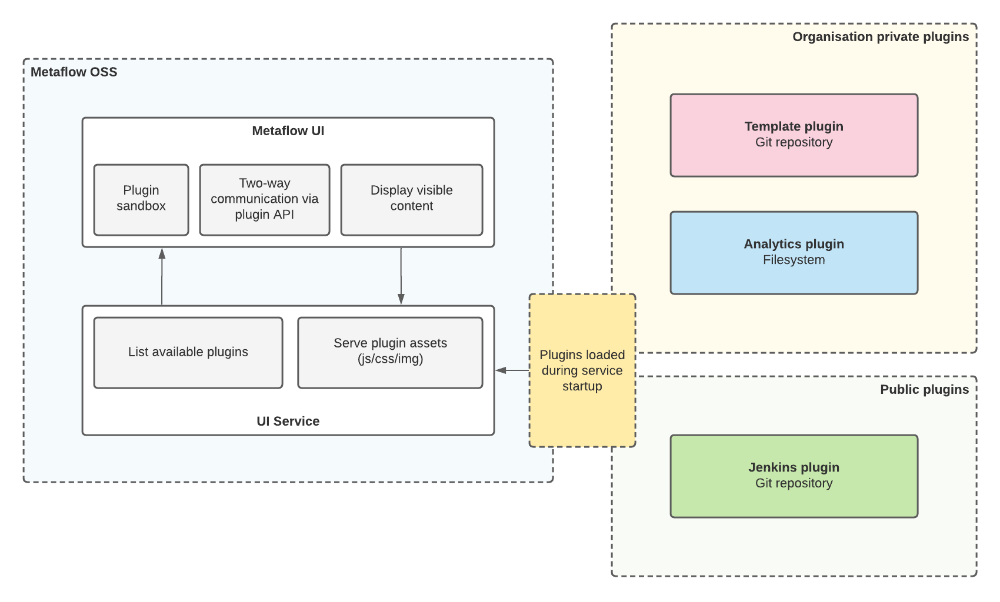
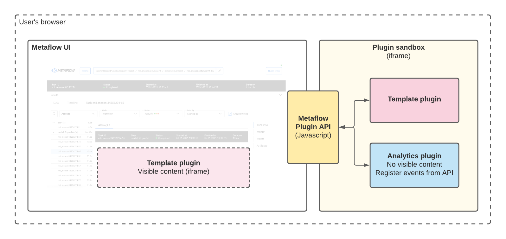

# Plugin system



Metaflow UI has support for custom plugins. Plugins are limited to running in predefined slots within the UI. Plugins are installed server-side on the Metaflow UI service.

You can find the plugin JS API and examples from the [plugin-api](../plugin-api/README.md) folder.

## Getting started with plugin development

The easiest way to start developing plugins is to start up a local plugin development environment:

```sh
yarn dev:plugin
```

## How plugins works

Each plugin must have an HTML file as an entry point and manifest.json file for configurations. This HTML is rendered to an iframe at a certain spot within the UI. Plugins can also have javascript and CSS files.

Example of basic plugin HTML:

```html
<!DOCTYPE html>
<html lang="en">
  <head>
    <meta charset="UTF-8" />
  </head>
  <body>
    <div class="container" id="container">
      <h1>Plugin</h1>
      <div id="received"></div>
      <button id="button">click me to send custom event!</button>
    </div>

    <script src="MetaflowPluginAPI.js"></script>
    <script>
      (function () {
        Metaflow.onReady((configuration, resource) => {
          Metaflow.on(['customEventB'], (message) => {
            document.getElementById('received').textContent = 'Got message: ' + message.data;
          });

          Metaflow.subscribeToMetadata((message) => {
            console.log(`Metadata for ${resource.run_number} got updated! Metadata array for the task is ${JSON.stringify(message.data)}`);
          });
        });

        document.getElementById('button').onclick = function () {
          Metaflow.call('customEvent', 'Hello world');
        };
      })();
    </script>
  </body>
</html>
```

Example of manifest.json

```json
{
  "name": "Hello world plugin",
  "version": "0.0.1",
  "entrypoint": "plugin.html",
  "slot": "task-details", 
  "container": "collapsable"
}
```


This plugin is registered to be rendered in the task details section (path /FLOW_ID/RUN_NUMBER/STEP_NAME/TASK_ID in application). It subscribes to a custom event "customEvent" and is prepared to send another custom event "customEvent" on button click. It also subscribes for updates about task Metadata.

## Plugin slots

There are two implemented plugin slots, `run-header` and `task-details`. The desired slot must be defined in manifest.json file.

### run-header

The `run-header` plugin will be rendered below run details in a collapsable element.

### task-details

The `task-details` plugin will be rendered below task details in a collapsable element.

## Plugin configurations

Plugins can be given custom parameters from the server-side. These parameters will be passed to the plugin with the `onReady` callback call.

### Iframe sandbox



Since plugins are running within an iframe, they must comply with browser safety features. By default, we only give plugins "allow-scripts" rights. If your plugin requires more, you need to define them server-side with the `parameters.sandbox` property.

For example, we could allow plugins to take the main application to other URLs by giving them the "allow-top-navigation" flag.

```JSON
{
  "run-history-plugin": {
    "parameters": {
      "sandbox": "allow-top-navigation"
    }
  }
}
```

You can read more about iframe sandboxes in the [MDN web docs](https://developer.mozilla.org/en-US/docs/Web/HTML/Element/iframe#attr-sandbox)
